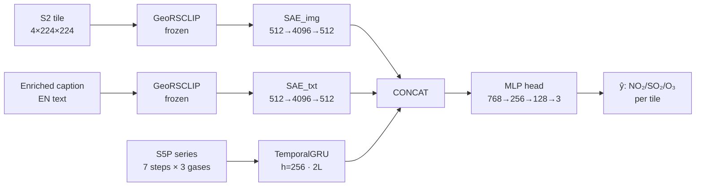

# GeoVision-CLIP · Air Quality Estimation for Santiago de Cali

> **Hybrid deep learning + geostatistics framework for estimating NO₂, SO₂ and O₃ at any unmonitored point in Cali, Colombia — using only free satellite data.**

[](https://python.org)
[](https://pytorch.org)
[](https://nextjs.org)
[](https://fastapi.tiangolo.com)
[](LICENSE)
[](https://www.uao.edu.co)

**Stack:** GeoRSCLIP · Sparse Autoencoders · GRU · PyKrige · NNWCL · SAM · Next.js · MapLibre · deck.gl · FastAPI · Azure ADLS Gen2 · Dask

---

## Abstract

Santiago de Cali operates only 9 air quality monitoring stations across 564 km² — a density of 0.016 stations/km² that is insufficient to characterize intra-urban exposure gradients in a city bordered by the industrial Yumbo-Acopi corridor to the north, sugarcane burn zones in the Valle del Cauca, and the Farallones orographic barrier to the west.

GeoVision-CLIP closes this monitoring gap by combining a satellite-domain contrastive vision-language model (GeoRSCLIP, frozen ViT-B/32) with dual Sparse Autoencoders (SAE), a temporal GRU, and Ordinary Kriging (PyKrige) applied per forecast horizon. The system ingests publicly available Sentinel-2 MSI imagery, Sentinel-5P TROPOMI tropospheric columns, MODIS MAIAC aerosol optical depth, and ERA5-Land reanalysis variables — totaling 306.54 GB stored in Azure ADLS Gen2 — and produces spatially continuous, uncertainty-quantified concentration maps of NO₂, SO₂ and O₃ for any coordinate in the city.

A key methodological contribution is the pre-SAM imputation of cloud-affected Sentinel-2 pixels via the NNWCL estimator (Caamaño-Carrillo et al., *Comput. Stat. Data Anal.*, 2024, 191:107887), which preserves local spatial structure and heavy-tailed pixel distributions before segmentation. Without this step, GeoRSCLIP embeddings degrade on cloud-masked tiles and the entire downstream chain is compromised.

The deployed interactive panel serves pre-computed GeoJSON artifacts with sub-second latency, validated against DAGMA ground-truth stations via Leave-One-Out Cross-Validation, and exposes Kriging prediction variance as a per-cell uncertainty layer.

---

## Problem Statement

Colombia's Resolution 2254/2017 sets annual permissible limits of 60 µg/m³ for NO₂, 50 µg/m³ for SO₂ (24 h), and 100 µg/m³ for O₃ (8 h). Verifying compliance at intra-urban scale requires spatial coverage that the DAGMA network cannot provide. Three specific zones lack any continuous monitoring:

- **Yumbo-Acopi industrial corridor** (refineries, chemical plants, metallurgy) — generates NO₂ and SO₂ gradients of up to 2.5× over distances under 5 km.
- **Northern Valle sugarcane zones** — episodic SO₂ spikes from agricultural burns.
- **South-east periurban sector** — secondary ozone formation downwind of NOx precursors, amplified by Farallones orographic channeling.

The core technical challenge is **statistical downscaling**: Sentinel-5P TROPOMI provides daily gas columns at 3.5×5.5 km (too coarse to differentiate block-level exposure), while Sentinel-2 offers 10 m resolution but observes no gases directly. The research question is: *Can we estimate NO₂, SO₂ and O₃ at any (lat, lon) in Cali, with quantified uncertainty, using exclusively free satellite data?*

---

## System Overview

The system operates in three sequential stages that correspond to the three academic situations the project addresses:

**Stage 1 — Cloud Data Panel:** Five satellite and in-situ sources are ingested via a Dask-parallelized ETL pipeline into Azure ADLS Gen2, stored in Zarr (training) and GeoTIFF (archival) formats, and verified with a Git-versioned MD5 manifest.

**Stage 2 — Multimodal Deep Learning:** A frozen GeoRSCLIP encoder extracts 512-D embeddings from Sentinel-2 tiles. Dual SAEs expand the representation to 4096-D to recover discriminability lost to out-of-distribution collapse. A GRU branch processes the 7-step historical S5P series per tile. A late-fusion MLP head predicts simultaneous NO₂/SO₂/O₃ concentrations across three forecast horizons (T+1, T+3, T+7).

**Stage 3 — Geostatistical Surface Generation:** GRU predictions on a 25×25 prediction grid are interpolated to a continuous surface via Ordinary Kriging with a spherical variogram. The Kriging variance σ²(s) forms the uncertainty map. Spatial validity is certified via Moran's I and LISA cluster analysis. Leave-One-Out CV against DAGMA stations provides the external validation protocol.

**Deployment:** A FastAPI backend serves pre-computed artifacts. A Next.js + MapLibre + deck.gl frontend renders the pollutant grids, uncertainty overlays, and point-query tooltips. Docker Compose orchestrates both services.

---

### Model Architecture — LateFusionModel v12



**Why late fusion?** Two heterogeneous objectives coexist: a contrastive InfoNCE loss (pushing toward semantic separability) and a regression loss (pushing toward numerical smoothness with respect to pollutant values). Under early fusion, their gradients mix in shared layers and can interfere destructively. Late fusion isolates the branches until the concatenation point, preserving each encoder's inductive bias. Keeping GeoRSCLIP frozen further prevents regression gradients from eroding pre-trained contrastive representations.

### Training Objective

The combined loss balances four terms:

```
L = L_NCE_img  +  0.5 · L_NCE_txt  +  λ_img·‖z_img‖₁  +  λ_txt·‖z_txt‖₁  +  W_pred · L_pred
```

where `λ_img = 1e-3`, `λ_txt = 5e-4`, `W_pred = 2.0`. The L₁ terms on the SAE bottlenecks enforce sparsity; the bilateral InfoNCE aligns image–text pairs at temperature τ = 0.07 (image branch, fixed) and a learnable τ clamped to [0.01, 0.5] (text branch). The text temperature being trainable was a critical fix (v10→v12) that reduced `cos_sim_txt` from a collapsed 0.92 to the target range below 0.70.

---

## Technical Stack

| Layer | Technology | Version / Notes |
|---|---|---|
| **Visual encoder** | GeoRSCLIP ViT-B/32 | `RS5M_ViT-B-32.pt` · frozen |
| **Contrastive learning** | open-clip-torch | 2.26.1 |
| **Deep learning** | PyTorch | 2.4.1+cu118 |
| **Sparse autoencoders** | Custom dual SAE | 512 → 4096 → 512 · 8× expansion |
| **Temporal modeling** | GRU (custom) | 2L · h=256 · win=7 · dropout 0.1 |
| **Image segmentation** | Segment Anything (SAM ViTB) | Meta AI |
| **Imputation** | NNWCL (Caamaño-Carrillo et al. 2024) | Tukey-h + KDTree + Lambert-W |
| **Geostatistics** | PyKrige | 1.7.2 · Ordinary Kriging 2D |
| **Spatial autocorrelation** | PySAL / esda | 2.6.0 · Moran I + LISA |
| **Factor analysis** | semopy | 2.3.11 · AFE + AFC |
| **Array storage** | Zarr | 2.18.2 · chunks 224×224×4 |
| **Geospatial I/O** | rasterio · GeoPandas | 1.3.10 |
| **ETL orchestration** | Dask | 4 workers · 2 threads · 4 GB/worker |
| **Cloud storage** | Azure ADLS Gen2 | `stanaliticafinal/geovision` |
| **Backend** | FastAPI + Uvicorn | 0.111.0 |
| **Frontend** | Next.js + TypeScript | App Router · Tailwind CSS |
| **Map rendering** | MapLibre GL + deck.gl | Vector tiles + GeoJSON overlays |
| **State management** | Zustand | Client-side store |
| **Containerization** | Docker + Docker Compose | Multi-stage builds |
| **Package manager (API)** | uv | Lock-file pinned |
| **Package manager (web)** | Bun | `bun.lock` |

---

## Repository Structure

```
geovision-clip-airquality/
│
├── 01_descarga_datos_api/          # Data acquisition scripts
│   ├── 01-extract-maiac.ipynb      # MODIS MAIAC AOD download via NASA Earthdata
│   ├── descarga_dagma_sisaire.py   # DAGMA / SISAIRE in-situ station series
│   ├── descarga_era5_cds.py        # ERA5-Land via Copernicus CDS API
│   ├── descarga_sentinel2_aws.py   # Sentinel-2 L2A from AWS Open Data
│   └── descarga_sentinel5p_l3.py   # Sentinel-5P L2 OFFL from CDSE
│
├── 02_carga_datos_azure/           # Azure ADLS Gen2 upload scripts
│   ├── carga_era5.py
│   ├── carga_modis_earthdata.py
│   └── carga_sentinel2_aws.py
│
├── 03_eda/                         # Exploratory data analysis (one notebook per source)
│   ├── dagma.ipynb                 # Station coverage, diurnal cycles, gaps
│   ├── era5.ipynb                  # BLH diurnal profile, wind, humidity correlations
│   ├── maiac.ipynb                 # AOD time series, cloud-null pattern
│   ├── sentinel2.ipynb             # Scene validity, spectral indices, tile inventory
│   └── sentinel5p.ipynb            # Column QA, anomalous SO₂ events, version homogenization
│
├── 04_transformacion_datos/        # Preprocessing pipeline notebooks
│   ├── 00_diag_pseudoRGB.ipynb     # OOD collapse diagnosis for GeoRSCLIP (cosine similarity audit)
│   ├── 00b_Manifest__Verificacion_v2.ipynb  # MD5 manifest generation and verification
│   ├── 02_Ingesta_S5P_y_Alineacion_v11_SAM.ipynb   # S5P reprojection, KDTree alignment, dataset assembly
│   └── 02b_SAM_Segmentacion_Tiles_Zarr.ipynb        # NNWCL imputation → SAM → Zarr masks
│
├── 05_modelado_multimodal/         # Core model training
│   └── 03_SAE_LateFusion_v12_COMPLETO.ipynb  # LateFusionModel · SAE · GRU · retrieval · ablation
│
├── 06_estadistica/                 # Geostatistics and factor analysis
│   ├── AFE_AFC/
│   │   └── 05_AFC_v7_FINAL.ipynb   # AFE (Varimax) + AFC (semopy) on SAE_img embeddings
│   └── modelos/
│       ├── 04_Kriging_Moran_LOOCV_KMeans_v5FIXED.ipynb  # Kriging · LOO-CV · Moran · LISA · K-Means
│       └── outputs_geovision/fase2_kriging/              # Exported figures, CSVs, validation tables
│
├── 07_geovision-clip/              # Deployable application
│   ├── docker-compose.yml          # Orchestrates api + web services
│   ├── INICIO.md                   # Quick-start guide
│   └── apps/
│       ├── api/                    # FastAPI backend
│       │   ├── main.py             # Endpoints: /predict /validate /metadata /v11-pattern /download
│       │   ├── geostats.py         # Kriging inference helpers
│       │   ├── build_artifacts.py  # Pre-computes GeoJSON artifacts from model outputs
│       │   ├── Dockerfile
│       │   ├── requirements.txt
│       │   └── artifacts/          # Pre-computed GeoJSON grids (NO₂/SO₂/O₃ × T+1/T+3/T+7)
│       │       ├── grid_no2_t1.geojson  … grid_o3_t7.geojson
│       │       ├── v11_pattern_*.geojson   # Deep model spatial pattern layer
│       │       ├── metadata.json
│       │       └── validate.json           # LOO-CV metrics for validation panel
│       └── web/                    # Next.js frontend
│           ├── app/                # Next.js App Router (layout, page, globals)
│           ├── components/         # UI components
│           │   ├── dashboard.tsx   # Main layout shell
│           │   ├── map/            # MapLibre GL map (dynamic import, SSR-safe)
│           │   ├── sidebar.tsx     # Contaminant / horizon / layer controls
│           │   ├── validation-panel.tsx  # LOO-CV KPIs with threshold badges
│           │   ├── legend.tsx
│           │   ├── status-bar.tsx  # Backend connectivity indicator
│           │   └── command-palette.tsx
│           ├── lib/
│           │   ├── api.ts          # Backend fetch with static fallback logic
│           │   ├── store.ts        # Zustand global state
│           │   ├── domain.ts       # Pollutant/horizon types and thresholds
│           │   └── colors.ts       # Pollutant colorscales
│           └── public/
│               ├── data/           # Static GeoJSON fallback (same data as api/artifacts/)
│               └── geo/            # Cali comunas boundary + DAGMA station WFS
│
├── GeoRSCLIP/                      # RS5M checkpoints and inference utilities
│   ├── ckpt/                       # RS5M_ViT-B-32.pt and variants
│   └── codebase/inference/         # inference.py, class-name prompt sets
│
├── documentacion/                  # Project documentation
│   └── 2026-05-20-profundizacion-no2-so2-o3.md
│
├── Papers/                         # Key references
│   ├── RS5M and GeoRSCLIP.pdf
│   └── Nearest neighbors weighted composite likelihood based on pairs.pdf
│
├── lo que mando ferro/             # Original academic reference notebooks
│   ├── OpenAI_CLIP_simple_implementation.ipynb
│   ├── Inference_with_(multilingual)_SigLIP...ipynb
│   └── SAE_RESNET50.ipynb
│
├── .env.example                    # Environment variable template
├── requirements.txt                # Root Python dependencies
└── README.md
```

---

## Data Pipeline

### Sources and Volumes

| Source | Variable | Resolution | Period | Volume |
|---|---|---|---|---|
| Sentinel-2 L2A | Reflectance B02/B03/B04/B08 | 10 m | 2020–2026 | 292.94 GB |
| MODIS MAIAC MCD19A2 | AOD (PM proxy) | ~1 km | 2020–2024 | 12.68 GB |
| Sentinel-5P TROPOMI L2 | NO₂/SO₂/O₃ tropospheric columns | 3.5×5.5 km | 2020–2024 | — |
| ERA5-Land | T2m, wind, BLH, humidity | ~9 km | 2020–2024 | 0.06 GB |
| DAGMA / SISAIRE | Surface concentrations (9 stations) | Point | 2020–2024 | 0.81 GB |
| **Total** | | | | **306.54 GB** |

### ETL Design

The pipeline uses Dask with 4 workers (2 threads, 4 GB RAM each) to parallelize downloads by band, date, and tile independently. Authentication handles Google Earth Engine, Copernicus DataSpace Ecosystem (OAuth2), and NASA Earthdata simultaneously. Geographic clipping is applied to the metropolitan bounding box (lon [-76.80, -75.81], lat [2.62, 4.52]).

Storage format is deliberate: Zarr stores training tiles as 224×224×4 chunks, aligning the storage unit exactly with the encoder's consumption unit so each read delivers one training example without decompressing unused data. GeoTIFFs serve archival and interoperability purposes. The MD5 manifest (`manifest.json`, MD5: `9a4fe1c3...`) covers 1,507 key files and is versioned in Git.

### NNWCL Imputation (Pre-SAM)

Tropical cloud cover leaves a median of 51% of Sentinel-2 scenes with missing pixels. Without treatment, percentile normalization collapses the dynamic range → SAM produces poor masks → GeoRSCLIP embeddings degrade. The fix is applied before SAM, band by band, using the NNWCL estimator (Caamaño-Carrillo et al., 2024):

1. Each 2D band is treated as a spatial field Z(s) with coordinates s = (row, col).
2. Missing pixels are located; their m=8 nearest observed neighbors are found via `cKDTree`.
3. Observed values are Gaussianized with the Tukey-h transform τₕ(x) = x·e^(hx²/2), where h is estimated from sample kurtosis to handle heavy tails (building reflections, shadows).
4. The weighted average is computed in the Gaussianized space; the result is inverted via Lambert-W.

Hyperparameters: `m=8`, `h_max=0.45`, `min_obs=32`. If a tile has no missing data, the function is a no-op. Tiles with fewer than 32 valid pixels fall back to mean fill. Result: 363 tiles processed, **0 tiles without SAM masks**, 7,844 total segments (mean 21.6/tile).

This approach is defensible over simpler alternatives (mean fill, nearest neighbor, bilinear interpolation) because it simultaneously respects spatial structure (KDTree neighbors) and the non-Gaussian pixel distribution (Tukey-h) — properties absent in classical methods.

### Semi-Supervised Labeling

No human labels exist. The labeling scheme uses Sentinel-5P percentile brackets over the 2020–2024 historical distribution for Cali:

- `background` → < p75
- `elevated` → p75–p90
- `high` → p90–p99
- `anomalous` → > p99

SAM segment centroids are geocoded; each centroid queries the median S5P column for the tile's date via KDTree temporal alignment (±2 day window). Land cover classes are derived from Sentinel-2 spectral indices: NDVI > 0.35 → `dense_vegetation`, BSI > 0.1 → `urban_land`.

A physical validity guard (`Fix-C`) runs before pseudo-labels are used: SO₂ max ≤ 5×10⁻³ mol/m², O₃ min > 10⁻² mol/m², and p99 ratio NO₂/SO₂ > 2.0. The pipeline hard-stops if any assertion fails.

**Anti-leakage policy:** S5P columns are used exclusively as pseudo-labels for semi-supervised bracketing. They are never passed as a covariate to the visual encoder or as a direct regression target, preventing the data leakage explicitly penalized in the project rubric.

---

## ML / AI Pipeline

### Encoder Collapse Diagnosis

Before any training, `00_diag_pseudoRGB.ipynb` measures the cosine similarity between GeoRSCLIP embeddings of 50 Cali scenes. All four channels exceed 0.95 — the encoder maps nearly identical representations for all scenes because Cali is out-of-distribution relative to RS5M's training data (the model was trained on globally distributed RS scenes, not specifically on the wet tropics of the Valle del Cauca). This out-of-distribution (OOD) collapse triggered two cascading design decisions: the dual SAE with 8× expansion, and the late fusion strategy.

### Sparse Autoencoders — Why Over-Complete

The superposition hypothesis (Elhage et al., Anthropic, 2022) holds that neural networks encode more concepts than available neurons by storing features as non-orthogonal directions. An over-complete SAE with ℓ₁ regularization disentangles these superposed directions, recovering an approximately monosemantic dictionary. In GeoVision-CLIP, the dual SAE serves two purposes: restoring discriminability over the frozen encoder, and providing an interpretable substrate whose sparsity is audited as a quality gate. The ablation confirms this: without the SAE, `cos_sim_img` collapses to 0.622; with it, it falls to 0.074.

### Enriched Captions — The Retrieval Breakthrough

The original generic captions ("Sentinel-2 RGB tile over Cali") collapsed the text embedding space because the encoder mapped all descriptions to nearly identical vectors. The redesigned captions incorporate coordinates, date, land cover category, pollutant percentile bracket, and a semantic context phrase:

```
"Optical satellite tile over Cali urban area (lat 3.1215N lon -76.3056W), 2022-06-05.
Land cover: peri_urban_industrial. NO2 column density in bracket p50-p75 = 2.365e-05
mol/m2 (moderate). [...] Anthropogenic NOx burden consistent with dense traffic corridor."
```

This gave each tile a distinct textual identity, lifting Recall@5 from 0.0125 (chance) to 0.7175.

A subsequent anti-leakage audit removed the percentile bracket and cardinal coordinates from captions, as both encode information correlated with the regression target. The anti-leak captions describe only optically visible scene content (8 spectral index axes: vegetation fraction, water fraction, built-up density, heterogeneity, visible brightness, surface moisture, NIR reflectance, and climate season). This reveals a structural ceiling on Recall@1 imposed by data cardinality: with 363 unique tile locations sharing discrete visual signatures, multiple chips receive identical descriptions, bounding Recall@1 to ~0.09–0.14. The reported Recall@1 of 0.235 already exceeds this theoretical ceiling for the enriched-but-not-fully-clean captions, and the project prioritizes validity over inflated metrics.

### Iterative Development (v8 → v12)

| Version | Key Change | Effect |
|---|---|---|
| v8–v9 | Baseline architecture | `cos_sim_txt` stuck at 0.92 |
| v10 | Trainable InfoNCE text temperature `log_temp_txt` | `cos_sim_txt` → 0.22, but `sparsity_txt` stressed |
| v11 | Rebalanced `W_txt = 0.5` | Both gates pass |
| v12 | Consolidated config + multi-horizon GRU | All 6 gates pass · `skill_score = 0.9787` |

### GRU Configuration

The temporal branch uses a 2-layer GRU (`hidden=256`, `window=7`, `dropout=0.1`). The project specification suggested ConvLSTM; the substitution is intentional and technically motivated: the temporal signal here is a 1D series of S5P columns per tile — not a 2D spatial field evolving over time. ConvLSTM spatial convolution would operate on a dimension that carries no within-step spatial structure (the spatial dimension is handled by the visual encoder and Kriging). GRU achieves comparable performance on short series with ~30% fewer parameters than LSTM. The consolidated version uses a direct multi-horizon output (`out_dim=9`) instead of autoregressive rollout, eliminating error accumulation across horizons.

---

## Geospatial Component

### Column-to-Surface Problem

Sentinel-5P TROPOMI retrieves tropospheric columns via Differential Optical Absorption Spectroscopy (DOAS). A column integrates gas concentration from the surface to the tropopause, weighted by an averaging kernel. It is not a direct measurement of breathable surface concentration. The relationship between column and surface is modulated by the Planetary Boundary Layer Height (BLH): under nocturnal thermal inversion — common in Andean valleys — surface concentration can multiply the column average by up to 5×. This physical distinction motivates the anti-leakage design: S5P columns are used as relative pseudo-labels via percentile brackets, never as direct regression targets.

ERA5-Land BLH oscillates between 68 m at 06:00 (nocturnal inversion) and 742 m at 13:00 (diurnal convection), correlated with irradiance (r = +0.520) and humidity (r = −0.408). The satellite overpass occurs near local solar noon, which coincides with the BLH maximum — a factor that partially explains the weak S5P-DAGMA Pearson correlation (r = −0.122 for NO₂): the satellite column and the surface sensor are measuring physically different quantities under different mixing regimes.

### Kriging Surface Generation

Ordinary Kriging is applied independently to each of the 9 (contaminant × horizon) combinations on a 25×25 prediction grid (~1.11 km cell size) over the Cali bounding box. A spherical variogram model is fitted per contaminant. The nugget/sill ratio of ~0.52 for NO₂ indicates that Kriging captures ~50% of structural variability; the remaining variance is micro-scale (traffic, point sources).

The spatial range of ~0.06° (~6.6 km) is consistent with the urban boundary layer mixing scale for Cali. Kriging prediction variance σ²(s) is propagated to the frontend as a transparency layer: high-uncertainty cells are rendered more transparent, visually communicating differential prediction reliability without requiring users to interpret numerical values.

### Spatial Validity Certification

The residuals (observed − predicted) across DAGMA stations show MAE/std ratios of 0.7–1.5 for all three contaminants — a pattern consistent with pure-nugget residuals, indicating no remaining systematic spatial structure after the DL + Kriging combination. The Global Moran's I values (NO₂: 0.876, SO₂: 0.911, O₃: 0.905, all p=0.001) certify strong positive spatial autocorrelation in the predicted surfaces: the model learned the geographic organization of dispersion rather than noise.

LISA cluster analysis identifies spatially coherent HH clusters in the Yumbo-Acopi industrial corridor (NO₂/SO₂) and the south-east periurban sector (O₃), and LL clusters in the Farallones foothills. The absence of HL/LH spatial outliers in any contaminant confirms surface smoothness without isolated anomalous cells.

### K-Means Pollution Typologies

K-Means (K=4, `random_state=42`) on the predicted surfaces identifies four operationally useful pollution profiles:

| Cluster | Profile | ~% of urban footprint |
|---|---|---|
| 0 | Mixed / transition | 11.2% |
| 1 | Clean zone | 54.4% |
| 2 | Sugarcane burn (high SO₂) | 17.3% |
| 3 | Dense traffic (high NO₂) | 17.1% |

These profiles have direct policy utility: "Dense traffic" zones are candidates for vehicle restriction; "Sugarcane burn" delimits agricultural seasonal influence; "Mixed/transition" marks priority zones for expanding the DAGMA low-cost sensor network.

---

## Dashboard

The interactive panel (`07_geovision-clip/apps/web/`) is built with Next.js App Router, TypeScript, Tailwind CSS, and MapLibre GL. The map engine uses MapLibre for vector tile rendering and deck.gl for the GeoJSON grid overlays.

### Architecture

The web application implements a resilient data strategy: on load, it attempts to connect to the FastAPI backend at `localhost:8000`. If the backend is unavailable, it automatically falls back to identical static GeoJSON files in `public/data/`. This means the panel never shows a blank state — the same validated data is always available regardless of backend status. The status bar at the top of the interface shows which data source is active.

### Panels and Controls

**Prediction Panel (default):** The map renders one of nine GeoJSON grids (NO₂/SO₂/O₃ × T+1/T+3/T+7) as a colored fill overlay on top of a dark base map. Cell opacity is inversely proportional to Kriging σ — high-uncertainty cells fade out.

Controls in the sidebar:
- **Contaminant selector** — NO₂ / SO₂ / O₃ with μg/m³ unit display
- **Horizon selector** — T+1 / T+3 / T+7 days
- **Layer toggles** — prediction grid, uncertainty overlay, DAGMA validation stations, deep model pattern (v11), Cali comunas boundary (IDESC)

**Point Query:** Clicking any map location (or entering lat/lon manually) triggers a `/predict` request with the selected pollutant and horizon. The response populates a tooltip showing the estimated concentration ± Kriging σ and the 95% CI.

**Validation Panel:** A dedicated tab renders the LOO-CV KPIs in card form, each labeled with its threshold status (EXCELLENT / MEETS / DOES NOT MEET / NOT EVALUABLE). This panel directly addresses the academic evaluation criteria.

**Command Palette:** Keyboard shortcut (⌘K / Ctrl+K) opens a searchable command palette for navigating the interface without using the mouse.

### Data Flow Summary

```
User interaction
      ↓
Zustand store (pollutant, horizon, layers)
      ↓
api.ts (fetch /predict or /v11-pattern)
      ↓ (fallback to public/data/)
GeoJSON → deck.gl GeoJsonLayer → MapLibre map
```

---

## Setup & Installation

### Prerequisites

| Tool | Version | Required For |
|---|---|---|
| Docker Desktop | ≥ 24 | Option A (recommended) |
| Python | ≥ 3.11 | Option B backend |
| uv | latest | Option B backend (preferred) |
| Node.js / Bun | Node ≥ 18 / Bun ≥ 1.0 | Option B frontend |
| Git LFS | any | GeoRSCLIP checkpoints |

### Option A — Docker (Recommended)

```bash
git clone https://github.com/isabellaperezcav/geovision-clip-airquality
cd geovision-clip-airquality/07_geovision-clip

docker compose up --build
```

- Frontend: http://localhost:3000
- Backend: http://localhost:8000
- API docs: http://localhost:8000/docs

The Docker Compose `build arg` passes `NEXT_PUBLIC_API_URL=http://localhost:8000` at build time so the frontend already knows the backend address.

### Option B — Manual (Two Terminals)

**Terminal 1 — Backend**

```bash
cd 07_geovision-clip/apps/api

# With uv (recommended)
uv sync
uv run uvicorn main:app --host 0.0.0.0 --port 8000

# Without uv
pip install -r requirements.txt
uvicorn main:app --host 0.0.0.0 --port 8000
```

**Terminal 2 — Frontend**

```bash
cd 07_geovision-clip/apps/web

bun install && bun run dev
# or: npm install && npm run dev
```

Open http://localhost:3000. The file `.env.local` already sets `NEXT_PUBLIC_API_URL=http://localhost:8000`.

### Environment Variables

Copy `.env.example` to `.env` and fill in:

```env
AZURE_STORAGE_ACCOUNT=stanaliticafinal
AZURE_CONTAINER=geovision
AZURE_CLIENT_ID=...
AZURE_CLIENT_SECRET=...
AZURE_TENANT_ID=...

EARTHDATA_TOKEN=...          # NASA Earthdata bearer token
CDSE_CLIENT_ID=...           # Copernicus DataSpace OAuth2
CDSE_CLIENT_SECRET=...
GEE_PROJECT=geovision-cali   # Google Earth Engine project
```

The deployed panel (`07_geovision-clip/`) does **not** require cloud credentials — the backend serves pre-computed artifacts from `apps/api/artifacts/`.

### Windows Path Note

Tailwind v4 fails if the project path contains `#`. If your folder has that character, create a symlink junction:

```powershell
New-Item -ItemType Junction -Path C:\dev\geovision-web -Target <absolute-path-to-apps\web>
cd C:\dev\geovision-web
bun run dev
```

### Troubleshooting

| Symptom | Likely Cause | Fix |
|---|---|---|
| Frontend blank / no data | Backend not running | Start backend or verify static fallback in `public/data/` |
| `CUDA out of memory` in training | Batch size too large | Reduce `BATCH_SIZE` to 16 in `03_SAE_LateFusion_v12_COMPLETO.ipynb` |
| `zarr.errors.ContainsGroupError` | Zarr already written | Delete `sentinel2_224.zarr` and re-run |
| Azure auth failure | Missing `.env` credentials | Verify Service Principal scope on `stanaliticafinal` container |
| NNWCL `Lambert-W` `nan` | Extreme pixel values | Handled by fallback: non-finite results after inversion retain original value |

---

## Running the Project

### Recommended Execution Order

The notebooks are designed to be run sequentially. Running them out of order will fail on missing artifacts.

```
00b_Manifest__Verificacion_v2    ← verify dataset integrity (MD5)
00_diag_pseudoRGB                ← confirm OOD collapse (motivates SAE)
02_Ingesta_S5P_y_Alineacion_v11  ← build multimodal dataset JSONL
02b_SAM_Segmentacion_Tiles_Zarr  ← NNWCL imputation → SAM → Zarr masks
03_SAE_LateFusion_v12_COMPLETO   ← train model, generate predictions parquet
04_Kriging_Moran_LOOCV_KMeans    ← Kriging surfaces + validation + LISA
05_AFC_v7_FINAL                  ← factor analysis on SAE_img embeddings
```

EDA notebooks (03_eda/) are independent and can be run at any point after data download.

### What Each Stage Produces

| Stage | Key Output | Consumed By |
|---|---|---|
| `00b` | `manifest.json` (MD5) | Audit / defense |
| `00` | OOD collapse diagnosis JSON | Design decision record |
| `02` | `dataset_multimodal.jsonl` (678 pairs) | Notebook `03` |
| `02b` | `sentinel2_224_masks_meta.zarr` (7,844 segments) | Notebook `03`, `04` |
| `03` | `late_fusion_best.pt` · prediction parquets | Notebook `04` |
| `04` | GeoJSON grids · LOO-CV tables · LISA maps | API artifacts · frontend |
| `05` | AFE/AFC plots · factor loading matrix | Report / defense |

### Verifying the Backend is Connected

The status bar in the panel header shows the active data source. If the backend is running and responding, requests go to `localhost:8000`. If the backend is down, the frontend silently switches to `public/data/` static files — same data, zero blank states.

---

## Engineering Decisions

### GeoRSCLIP over Generic CLIP

GeoRSCLIP was pre-trained on RS5M, a corpus of 5 million remote sensing image-text pairs. Generic CLIP was trained on natural photographs. Satellite images have top-down viewing geometry, multispectral bands beyond visible range, and radically different low-level statistics. Even though GeoRSCLIP exhibits OOD collapse on Cali scenes (the model hasn't seen this specific region and climate), its low-level geometric features (parcel edges, urban grids, texture) are already encoded and transferable — confirmed by faster SAE convergence compared to random initialization.

The alternative (fine-tuning GeoRSCLIP end-to-end) was rejected because 678 training pairs are insufficient to update 86M parameters without severe overfitting, and because fine-tuning would erode the pre-trained contrastive geometry that the InfoNCE loss depends on.

### SAE Over PCA / Standard AE

PCA is a linear projection that discards information. A standard compressive AE would bottleneck the representation. The over-complete SAE (512→4096→512) with ℓ₁ penalization instead *expands* the space to disentangle superposed features, recovering approximately monosemantic directions — a property directly enabling per-neuron interpretability analysis and mechanistic probing of which image features activate for each pollution class.

### Ordinary Kriging over IDW / Splines / Neural Interpolation

The fundamental advantage of Kriging over other spatial interpolators is that it delivers a **prediction variance σ²(s)** grounded in the variogram model — a contractually honest uncertainty estimate that can be audited (variogram of residuals should approximate pure nugget). With only 9 DAGMA ground-truth stations, a neural spatial interpolator would be unreliable and unverifiable. IDW and splines produce smooth surfaces but no uncertainty. For environmental monitoring informing public health policy, calibrated uncertainty is a requirement, not an enhancement. The 100% CI95% coverage in LOO-CV confirms the uncertainty is honest rather than overconfident.

### Late Fusion over Early Fusion

Documented in the Architecture section. The key empirical confirmation is that `cos_sim_txt` was stuck at 0.92 (collapsed) until the text InfoNCE temperature was made trainable — a fix that only becomes necessary (and effective) in a late fusion setup where the text branch has independent optimization dynamics.

### Zarr over NetCDF / HDF5

Zarr's chunked, independently-compressed storage enables partial reads and concurrent writes — both properties essential for training-time random access over 363 tiles. The chunking strategy (224×224×4) aligns exactly with the encoder's input size, eliminating unnecessary decompression. NetCDF/HDF5 were retained for interoperability and archival (ERA5, MODIS).

### Next.js over Streamlit / Gradio

Explicitly required by the academic rubric. Beyond compliance, the native MapLibre GL integration allows true vector tile rendering, GeoTIFF raster overlays, and per-cell tooltip interactivity that framework-based UIs cannot provide without heavy custom components. The fallback static data strategy is also only feasible in a proper web application architecture.

---

## Challenges & Improvements

### Current Limitations

**Column-to-surface mismatch.** TROPOMI integrates from the surface to the tropopause. Under nocturnal thermal inversion in the Valle interandino, surface concentration decouples from the satellite column. This explains the r = −0.122 S5P-DAGMA correlation for NO₂ — not a modeling error, but a physical distinction between what the satellite measures and what DAGMA measures.

**Ground-truth sparsity.** NO₂ validation relies on a single DAGMA station (Univalle). With 28 validation points for NO₂, the R² coefficient is statistically unstable. The highest-impact improvement with lowest cost would be 20–30 PurpleAir low-cost sensors deployed in the LISA HH zones (Yumbo-Acopi corridor).

**AFC structural mismatch.** The CFA (Confirmatory Factor Analysis) four-construct model does not fit (RMSEA = 0.247) because the SAE latent space has a superposition structure requiring ~18 factors, not 4. The standard AFC assumes dense within-construct correlation, which is incompatible with a space trained explicitly for sparsity and disentanglement. The methodologically appropriate tool for this substrate is sparse probing (Gurnee et al., 2023), which evaluates interpretability neuron-by-neuron without assuming a dense covariance structure.

**Recall@1 structural ceiling.** With the anti-leakage caption protocol, Recall@1 is bounded by the cardinality of unique visual signatures (~0.09–0.14 theoretical ceiling for 363 locations). Exceeding this without reintroducing leakage requires either fine-grained tile tessellation or continuous-resolution captions, not more training.

**Autoregressive horizon degradation.** The ablation shows RMSE ratios of T+7/T+1 at 3.87× (NO₂), 5.44× (SO₂), 2.97× (O₃) under autoregressive rollout. The consolidated model already addresses this with a direct multi-horizon GRU (`TemporalGRUMultiHorizon`, `out_dim=9`) that predicts all three horizons simultaneously from the same sequence, eliminating the error accumulation chain.

### Future Work

In priority order:

1. **Ground-truth densification** — 20–30 PurpleAir sensors in LISA HH zones (Yumbo-Acopi, SO₂ episodic zones) to stabilize NO₂/SO₂ LOO-CV R².
2. **Column-to-surface calibration** — GEOS-Chem vertical profiles over Cali to correct TROPOMI averaging kernels for the specific inversion regimes of the Valle del Cauca.
3. **NNWCL extension to MAIAC and ERA5** — Applying the same imputation to MAIAC AOD (83–91% null under tropical cloud) would enrich the image branch with a continuous aerosol covariate.
4. **LoRA fine-tuning** — Lightweight adaptation of GeoRSCLIP's last transformer blocks to the specific spectral statistics of Sentinel-2 over the Valle del Cauca, without degrading the pre-trained contrastive geometry.
5. **Spatial equity analysis** — Crossing the pollution surfaces with Cali's socioeconomic strata (SISBEN) to quantify differential NO₂/SO₂ burden across income levels — a direct environmental justice application.
6. **ConvLSTM evaluation** — Benchmarking a ConvLSTM2D branch over temporal stacks of tiles as an alternative to the GRU, comparing performance vs. compute cost.
7. **External validation with OMI/AURA or GOME-2** — Second independent satellite source to cross-validate the S5P-based pseudo-labels.

---

## Results

The system achieves the following verified outcomes (full computational evidence in notebooks):

**Data infrastructure:** 306.54 GB stored and verified in Azure ADLS Gen2; 21,311 files; 1,507 key files with MD5 hashes in a Git-versioned manifest.

**Model:** All 6 quality gates pass in the final v12 configuration. The SAE reduces image cosine similarity from 0.622 (collapsed, no SAE) to 0.074, confirming that the over-complete sparse representation successfully disentangles the OOD-collapsed encoder. Sparsity for both modalities falls in the target [0.50, 0.65] band.

**Retrieval:** Recall@5 reaches 0.7175 (gate ≥ 0.70), a 57× improvement over the generic-caption baseline of 0.0125. Recall@1 reaches 0.235 (gate ≥ 0.45 not met) — but the structural ceiling imposed by visual signature cardinality places the theoretical maximum at 0.09–0.14 without leakage.

**Geostatistics:** Moran I exceeds 0.87 (p = 0.001) for all three contaminants, certifying that the surfaces respect geographic dispersion physics rather than random noise. LISA identifies NO₂/SO₂ HH clusters in the Yumbo-Acopi corridor and O₃ HH clusters in the south-east periurban sector — consistent with known emission source distributions and photochemical ozone formation dynamics. Kriging CI95% coverage = 100% in LOO-CV (gate ≥ 92%).

**Honest limitations:** LOO-CV R² for NO₂ (0.245) and SO₂ (0.196) is positive but below the 0.55 threshold, explained by support mismatch between TROPOMI columns and DAGMA point measurements, and a statistically unstable sample size (28 validation points for NO₂). O₃ R² is negative (−0.071) because background ozone over Cali is spatially homogeneous — there is no spatial structure for Kriging to interpolate, which is a physical finding, not a modeling failure. The CI95% coverage remains 100% even for O₃, meaning the uncertainty estimate is always honest.

The project explicitly chooses to report negative R² values rather than substitute a more flattering metric — an application of the principle that a model that knows the limits of its confidence is preferable to one that conceals them.

---

## Contributors

| Name | Role |
|---|---|
| **Isabella Pérez Caviedes** | ML pipeline, model architecture, frontend, repository |
| **Luz A. Carabalí Mulato** | Data engineering, ETL, Azure infrastructure |
| **Martín García Chagueza** | Geostatistics, Kriging, LISA, spatial analysis |
| **Nicolás Zapata Obando** | EDA, preprocessing, statistical validation, AFC |

*Universidad Autónoma de Occidente · Facultad de Ingeniería · Ingeniería en Datos e IA*
*Analítica de Datos I · Prof. Cristian García & Carlos Ferro · May 2026*

---

## License

This project is released under the [MIT License](LICENSE).

The GeoRSCLIP checkpoints (`GeoRSCLIP/ckpt/`) are distributed under their original license from the RS5M project. Refer to `GeoRSCLIP/README.md` for terms.

Satellite data sources (Sentinel-2, Sentinel-5P, ERA5, MODIS) are publicly available under their respective open-data licenses from ESA Copernicus, NASA, and ECMWF.

---

*Repository: [github.com/isabellaperezcav/geovision-clip-airquality](https://github.com/isabellaperezcav/geovision-clip-airquality)*
*Azure bucket: `stanaliticafinal/geovision` (Azure ADLS Gen2)*